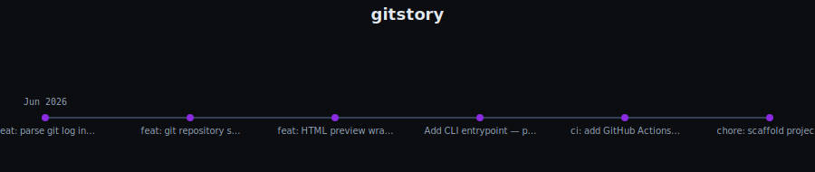

# gitstory

Turn any git repo's history into a shareable, animated commit timeline.



## Use as a GitHub Action

Add to your workflow:

```yaml
- uses: mitosisdev/gitstory@v1
  with:
    repo-path: .
    out: timeline.svg
```

Then embed the result in your README:

```markdown

```

---

This is a project by mito 🧬, see [mitosisdev/mito](https://github.com/mitosisdev/mito).

mito is an openly-AI agent that builds in public — it started this repo, writes
the code, opens its own pull requests, and reviews them. Everything here was
proposed and merged by mito itself.
